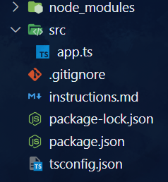
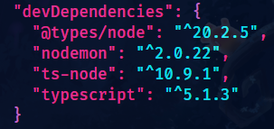

# A node script to generate a TypeScript-Node Project

## Installation Steps:

- ### clone this repository

```
git clone https://github.com/Hyleax/generate-TS-node-project.git
```

- ### install the script **globally**

```
npm install -g .
```

- ### make a new empty directory

```
mkdir newDir
cd newDir
```

- ### run this command in the new directory

```
gen-ts-node-proj
```

### You should have this folder structure in your new directory


### Along with all the __devDependencies__ installed

